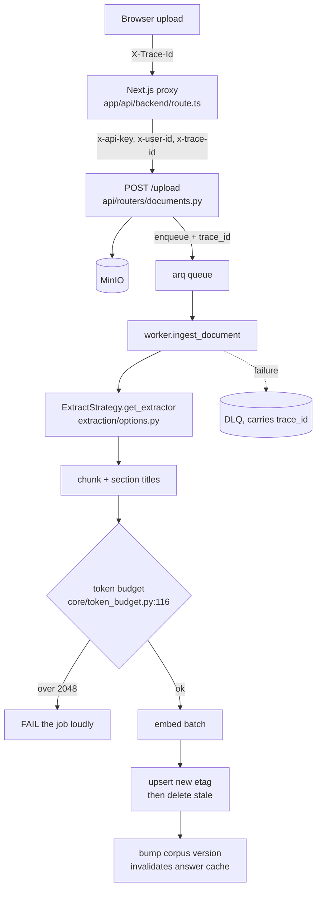
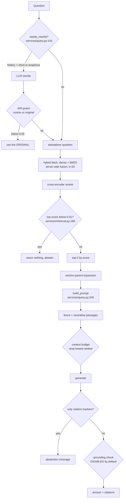

# KnowAll DocumentBot — Handoff

Written for someone who has never seen the work that produced it. Findings are
restated, not referenced by number. Every non-obvious claim cites `file:line`.
Anything undetermined says so, and says what would determine it.

`docs/REMEDIATION_LOG.md` is the chronological record with the evidence behind
each claim here. This document is the standing summary.

---

# 1. State of the system

## Is grounding on?

**No.** It is implemented, unit-tested, and **shipped disabled behind a flag**,
because enabling it on the generator that currently ships **destroys the
system's ability to answer at all**. Measured: the same 15 answerable questions
went from 13/15 answered to 2/15 when the grounding rule was added to the
prompt.

It works on a candidate generator that has not been adopted. That decision is
§2, and it has not been made.

## Shipped enabled

| what | where | behaviour |
|---|---|---|
| Abstention separated from relevance ranking | `services/retrieval.py:188` | One low bar decides "did retrieval return anything coherent"; ranking decides order. Previously one threshold did both and discarded correct answers. |
| Malformed-generation guard | `services/query.py:459` | A reply that is only citation markers (`[1] [1][3]`) becomes the abstention message instead of an empty bubble. |
| Query-rewrite drift guard | `services/query.py:172` | A rewritten follow-up whose meaning drifts from the original is discarded and the original used. |
| Prompt-injection containment | `services/passage_guard.py:96` | Retrieved passages are fenced, and fence/header/role/abstention-shaped text is stripped from their bodies. |
| Embedding + context token budgets | `core/token_budget.py:116,139` | An oversized chunk fails ingest loudly; an oversized prompt drops lowest-ranked passages. |
| Embedding-model identity enforcement | `core/model_identity.py:75` | Startup fails if the live model's digest differs from the pinned one. |
| Generation-model identity enforcement | `core/model_identity.py:122` | Same, for the generator. |
| Payload-index readiness | `api/routers/system.py` `/ready` | Returns 503 listing any missing index rather than serving silently-degrading queries. |
| Config coherence checks | `core/startup_checks.py` | Refuses to start on an unset/placeholder API key, or trusted proxy identity with a published port. |
| Vendored OCR language data | `api/Dockerfile`, `vendor/tessdata/` | Checksummed and build-gated, so OCR output cannot move without a diff. |
| Trace propagation | `core/tracing.py` | One id from browser to worker log to dead-letter queue. |

## Shipped disabled behind a flag

| flag | default | what flipping it does |
|---|---|---|
| `require_support_quotes` (`core/config.py:135`) | `False` | Requires the generator to quote a supporting sentence per citation, verified by string match. **On the shipped generator this collapses answering from 13/15 to 2/15.** Viable only on a generator that can satisfy an output contract. |
| `llm_enable_thinking` (`core/config.py:82`) | `False` | Lets a reasoning-capable generator emit chain-of-thought. Measured: with reasoning on and a structured prompt, 4383 characters of reasoning consumed the entire token budget and the answer came back **empty**, with the request reporting success. |
| `contain_untrusted_passages` (`core/config.py:146`) | `True` | Turning it **off** reproduces pre-containment prompt assembly byte-for-byte, dropping both the fences and the system-prompt clause. Measured cost of leaving it on: none, on either generator. |
| `rerank_score_floor` (`core/config.py:229`) | `0.0` (off) | Raising it to `0.25` restores the old per-chunk relevance cut. That value discarded correctly-ranked first-place answers; a test pins the old behaviour, so this is a config difference rather than a lost capability. |
| `digest_enforcement_from` (`core/config.py:101`) | set in compose | When set, a stored point with no embedding-model digest is **fatal** rather than "unknown". |
| `expected_embed_model_digest` / `expected_llm_model_digest` (`core/config.py:55,90`) | `None` | Unset = loud warning, drift undetectable. Set = hard fail on mismatch. |
| `trust_proxy_identity` (`core/config.py:275`) | `True` | Believes `X-User-Id` from callers. Safe only while the API port is unpublished; startup refuses the incoherent pair. |

## Measured, deliberately not changed

- **`parent_char_budget` × `rerank_top_n`** produce an almost fixed-size prompt
  — the upper mode spans 4% (5140–5375 tokens). Cutting it is a latency lever,
  but it trades against retrieval quality and only an eval can settle that.
- **Five payload fields** (`key`, `chunk_index`, `total_chunks`,
  `content_type`, `image_count`) are write-only or superseded. Dropping them
  only takes effect on reindex, so it is a data migration; it should ride along
  with a reindex that is happening anyway.
- **The abstention and concision rules in the system prompt cost ~2–3 answers
  in 15.** Changing the generation prompt was out of scope without approval.

## Untouched

- The cross-encoder reranker's behaviour (`BAAI/bge-reranker-base`).
- Chunk size, overlap, embedding model, distance metric.
- The retrieval algorithm: hybrid dense + sparse, server-side fusion, rerank.
- The frontend, beyond a two-line header pass-through in the proxy.
- Tier A corpus — **does not exist**.
- Tier C corpus — **planned, never built** (§11).

---

# 2. The generator decision

The largest open item. **Nothing has been switched.** `ollama_llm_model` still
defaults to `llama3.2:1b` (`core/config.py:70`).

## Why it is on the table

Three measurements against the shipped 1B generator. They are not three
separate defects — they are **one property measured three ways: it cannot be
relied on for instruction-following that is not answering the question.**

| measurement | result |
|---|---|
| The system prompt tells it to reply with an exact abstention string when the context lacks the answer | **0 of 4** near-miss questions declined |
| Any yes/no verdict framing | **"NO" is a fixed token, not a decision** — it answered NO to *"The sky is blue."* against the passage *"The sky is blue."*, and still answered NO when the labels were inverted so that YES meant "contradicts" |
| A structured output contract (quote a supporting sentence per citation) | answered questions dropped **13/15 → 2/15** |

The model reads passages correctly — it answers open questions accurately from
context. What it will not do is follow an instruction *about its own output*.

**That forecloses prompt-level grounding entirely.** A differently-worded rule,
a different verdict vocabulary, a looser format — all the same bet on the same
property. Do not spend a cycle on a fourth variant.

## The package — four coupled consequences

These move **together**. Read separately, a maintainer could pick an incoherent
combination: the candidate at concurrency 20 admits roughly five times what its
timeout tolerates; the incumbent at concurrency 4 throttles a model that
answers in seconds.

| | incumbent `llama3.2:1b` | candidate `qwen3.5:4b` |
|---|---|---|
| ollama container limit | 6 GiB sufficient | **8 GiB** — 6 was 98% consumed (5.90/6.0) at cold model load *while serving concurrent requests* |
| `max_concurrent_queries` | 20 (crossing far higher) | **4** — worst-case full-context latency crosses the 300 s read timeout at concurrency 8 |
| warm full-context latency | seconds | **~48 s** single-shot; ~62 s at concurrency 2 |
| grounding | **cannot be enforced** | abstention fires 3/4; verdict controls 5/5; quote emission 15/15, verified 14/15 |
| `require_support_quotes` | must stay off | **viable** — a default flip, no code change |

## What changed unconditionally, and what to revert

Changed because both are defects on **any** generator:

- **Ollama runtime 0.9.3 → 0.32.5**, pinned by digest
  (`docker-compose.yml:61`). Required to pull the candidate at all — it returns
  HTTP 412 on 0.9.3. The embedding vectors survived the upgrade: digest
  unchanged, cosine deviation `1.292e-07`, which is floating-point noise rather
  than re-quantization.
- **`max_concurrent_queries` 20 → 4** and the **container limit 6 → 8 GiB**.

> **If the incumbent is kept, revert the concurrency and memory changes.**
> They are sized for the candidate; leaving them throttles and over-provisions
> a model that is not running.

## The three options

1. **Accept documented ungrounded output.** Cheapest. Measured: 8 of 10
   unanswerable questions leak past retrieval, and 0 of 4 near-misses are
   caught by generation. Requires telling users.
2. **Add an entailment model.** The only remaining candidate that catches a
   claim which quotes truthfully and reasons wrongly from the quote. Three
   unmeasured risks: a small NLI model on French, at ~5000-token passages, in
   the container budget — plus a new-dependency decision.
3. **Adopt the candidate generator**, accepting the package above.

---

# 3. Method note — how these findings were produced

Five practices. They matter more than the results, because the next person will
be in the same position.

**1. Measure before tuning.** The original audit rated the rerank threshold's
risk *mitigated*. An eval baseline showed retrieval found the correct chunk for
**every** answerable question while only a third survived into the final answer
— the entire quality gap was after retrieval. Code review had looked at that
threshold and approved it.

**2. Test a guard by forcing its failure condition.** A guard nobody has seen
reject anything is indistinguishable from one that does nothing. Four guards
here passed their own tests while doing nothing:

- a model-pin verifier asserted the pinned file *existed* — which the download
  guarantees on its own;
- an identity test set an environment variable in the shell, which Docker
  Compose never passes into containers, so the "passing" test exercised
  nothing;
- a rewrite guard checked emptiness and length but not content, and passed a
  fluent rewrite about a different subject;
- 17 grounding tests were **green while the mechanism measured 0/15** — they
  fed well-formed input to the parser and never asked whether the generator
  could produce it.

**3. If a metric improves as load increases, the measurement is contaminated.**
Two artifacts, both caught by the shape being impossible rather than by care:

| observed | cause |
|---|---|
| concurrency 1 → 218.5 s, concurrency 2 → **19.0 s** | every call used an identical prompt; the inference server's prefix cache served the prefill |
| concurrency 4 → 332.7 s, concurrency 5 → **208.4 s** | level 4 ran first from an unloaded model, so its time included a cold load |

So: **never benchmark with a fixed prompt**, and **discard the first
measurement of any series**.

**4. Confirm a number measures the thing its threshold applies to.** A script
reported *16 chunks over the 2048-token embedding limit*. The count was
correct; the quantity was wrong — those were chunks *after context expansion*,
and the limit applies to the chunk *as stored*, which is never re-embedded. It
arrived **maximally credible because it confirmed a finding already in the
backlog**. A number that agrees with what you expect gets less scrutiny, not
more. Same units is not the same object.

**5. Having a rule written down is not the same as reaching for it.** The
Dockerfile broke twice on embedded multi-line shell during this work — the
second time *after* the fix (move it into a real script file) had already been
applied elsewhere in the same file and written into this document. Practice 2's
list was likewise written down before its fourth instance was introduced.
Expect to reintroduce known failures. The defence is a test that forces the
condition, not vigilance.

---

# 4. Run it in 10 minutes

```sh
cp .env.example .env
# Replace every REPLACE_ME_BEFORE_ANY_DEPLOY. The API refuses to start on the
# placeholder (core/startup_checks.py) — that is deliberate, not a bug.

docker compose up -d --wait
docker compose exec ollama ollama pull nomic-embed-text
docker compose exec ollama ollama pull llama3.2:1b

# Open http://localhost:3000 — the API port is bound to loopback on purpose.
```

Local development without credentials:

```sh
KNOWALL_INSECURE_DEV_MODE=i-understand-this-disables-authentication
```

Deliberately verbose, and it logs a banner on every startup. A quiet boolean is
what gets set in production and forgotten.

**The first query is slow** — the reranker and the generator both load on
demand. Cold start to first generation measured at 23.5 s.

---

# 5. RAG fact sheet

| | value | where |
|---|---|---|
| Embedding model | `nomic-embed-text:latest`, 768-dim | `core/config.py:50,65` |
| Embedding truncation | **silently truncates at 2048 tokens** — returns HTTP 200 with a well-formed vector built from a prefix | guarded at `core/token_budget.py:116` |
| Generator | `llama3.2:1b`, `num_ctx=8192`, `num_predict=1024`, `temperature=0.1`, **no seed** | `core/config.py:70-75` |
| Sparse leg | `Qdrant/bm25`, revision-pinned | `api/Dockerfile` |
| Reranker | `BAAI/bge-reranker-base`, revision-pinned | `api/Dockerfile` |
| Vector store | Qdrant; named dense + sparse vectors, int8 quantization, server-side fusion | `integrations/qdrant_store.py` |
| Chunking | 550 chars, 100 overlap; tables 1600 chars / 30 rows | `core/config.py:42-45` |
| Retrieved | `retrieval_fetch_k=20` → rerank → `rerank_top_n=5` | `core/config.py` |
| Context expansion | section-parent, `parent_char_budget=4000` | `services/retrieval.py:88` |
| Assembled prompt | median **5140 tokens**, max 5375, against an 8192 budget | `scripts/prompt_distribution.py` |
| Point IDs | `uuid5(source:etag:chunk_seq)` — stable, idempotent | `integrations/qdrant_store.py` |

`docs/rag_fact_sheet.yaml` carries the machine-readable version.

**Nominal chunk budgets understate real size by ~2×**: 550-char chunks and a
1600-char table budget have produced **2991-char** stored chunks, because
section prefixes and table row-groups stack on top of the nominal budget.

---

# 6. The two paths

## Ingestion



The upsert-then-delete order is the **staged cut-over**: every new-etag point is
written before any old one is removed, so a crash leaves either version fully
queryable and never a gap.

## Query



---

# 7. Where to change what

| to change | edit | then |
|---|---|---|
| a threshold or flag | `core/config.py` + `.env.example` | add it to the provenance tuple if it affects retrieval (`eval/provenance.py:63`) |
| retrieval behaviour | `services/retrieval.py` | re-run the retrieval eval; it is deterministic, tolerance zero |
| prompt assembly | `services/query.py:240` | passages are untrusted — see `services/passage_guard.py` |
| the system prompt | `services/query.py:36` | **two clauses are separately sanctioned**; a test pins that nothing else was added |
| extractors | `extraction/` | `section_title` matters — see the 43% coverage floor in §11 |
| a Qdrant filter | `integrations/qdrant_store.py` | **the field must be in `REQUIRED_PAYLOAD_INDEXES`** — a static test enforces it |
| the embedding model | anything | requires a reindex; use `scripts/alias_reindex.py` |

---

# 8. Invariants — do not break these

1. **Point IDs are `uuid5(source:etag:chunk_seq)`.** This makes ingestion
   idempotent and reindexes re-runnable. Changing the recipe orphans every
   existing point.
2. **Upsert new, then delete stale.** Reversing it creates a window with no
   queryable version.
3. **Every field used in a Qdrant filter must be indexed.** Otherwise the query
   full-scans and degrades silently as the corpus grows. Enforced by a static
   test that parses both lists out of the source.
4. **The eval corpus never shares a collection with real documents.**
   `eval/ingest_corpus.py` refuses the default collection outright.
5. **Full-mode eval requires the answer cache disabled.** The harness refuses
   to start otherwise.
6. **Asymmetric embedding prefixes** (`search_document:` / `search_query:`) and
   the cosine/model pairing are load-bearing. Do not "clean them up".
7. **Filters go inside the prefetch legs**, not after fusion.
8. **A trace id is never an identity.** It is browser-supplied and
   attacker-controlled: correlation only — never authorisation, cache key, or
   partition key.

---

# 9. Evaluation

## Running it

```sh
# deterministic, no LLM, tolerance zero
docker compose exec -e QDRANT_COLLECTION=knowall_eval api \
  python eval/run_eval.py --mode retrieval --runs 3

# LLM in the loop; refuses to run with the answer cache enabled
docker compose exec -e QDRANT_COLLECTION=knowall_eval \
  -e ENABLE_ANSWER_CACHE=false api \
  python eval/run_eval.py --mode full --runs 3
```

For a baseline anyone may later diff, pass the identity the container cannot
discover for itself:

```sh
-e KNOWALL_GIT_SHA=$(git rev-parse HEAD) \
-e KNOWALL_API_IMAGE_ID=$(docker inspect -f '{{.Id}}' knowall-documentbot-api)
```

## Reading it

- **Two abstention rates, never one.** `false_abstention_rate` (answerable
  questions that returned nothing — lower is better) and
  `correct_abstention_rate` (unanswerable questions that correctly returned
  nothing — higher is better). A single combined number read 1.000 on a run
  that abstained on 15 of 22 **answerable** questions.
- **Tiers are never averaged.** Tier B is deliberately adversarial.
- **`recall_at_fetch = 1.000` on tier B is arithmetic**, not quality: 18 chunks
  against `fetch_k=20` returns the whole corpus every time.
- **`mrr_at_k` is the retrieval-quality number**, not `hit_at_k`. Returning
  five chunks instead of one raises `hit_at_k` mechanically.

## Variance, and its three qualifications

Retrieval mode is genuinely deterministic: **0.0 spread across six passes on
two separate container builds.**

Full mode also measured **0.0 spread** — and that is **not** evidence of
stability. The generator is provably non-deterministic (3–5 distinct outputs in
10 calls at temperature 0.1). Zero spread is consistent with three different
explanations:

1. the pipeline genuinely did not vary;
2. the metric was too coarse to register it — at the time, results never
   exceeded one item, so `mrr_at_k` and `hit_at_k` carried one bit between
   them;
3. part of the work was served from the inference server's **prefix cache**,
   which disabling the answer cache does not disable.

> When full-mode variance is re-measured, **restart the ollama container
> between runs.** Otherwise the result needs three qualifications and is worth
> less than the run costs.

## What CI enforces

`.github/workflows/eval.yml`, two jobs. On PRs touching retrieval:
corpus-manifest integrity, embedding-model identity, golden-set schema,
rewrite-branch agreement, and **retrieval determinism** (two passes must agree
exactly). Nightly: full mode, reporting spread without gating on it.

**Metric-regression comparison is INACTIVE.** No baseline in `eval/baselines/`
is both provenance-complete and drawn from real documents, so the job emits a
warning saying the gate is off rather than passing silently.

---

# 10. Findings, restated

## Fixed

**The rerank threshold discarded correct answers.** One number decided both
"is anything relevant" and "which is most relevant". A correctly-ranked
first-place answer scoring 0.16 was thrown away because the bar was 0.25 — and
because a cross-encoder's absolute score tracks chunk *shape* (prose vs table
vs OCR) as much as relevance, it fell hardest on tables and scanned pages. Now
split into a very low abstention bar plus ranking. `services/retrieval.py:188`.

**Query rewrites could silently change the subject.** The guards caught
exceptions, empty output and gross length — but not meaning. A
records-retention follow-up came back as *"What is the policy on disposing of
hazardous waste?"*: fluent, correctly sized, past every check. Now guarded by
cosine similarity to the original, in the same space retrieval scores in.
`services/query.py:172`.

**The generator emitted citation markers with no prose.** `[1] [1][3]` and
nothing else — not an answer, not an abstention, and it passed every check
because it was non-empty, correctly sized and cited. Now treated as a failed
generation. `services/query.py:459`.

**Retrieved passages were untrusted input in the same channel as the
instructions.** Now fenced, with fence-, header-, role- and abstention-shaped
text stripped from bodies — because a fence a poisoned chunk can close is
decoration. `services/passage_guard.py:96`.

**Vectors carried no record of which model produced them.** A republished model
tag would have left a collection silently mixing two embedding spaces. Every
point now records model and digest, and a marker makes "no digest" fatal rather
than permanently ambiguous. `core/model_identity.py`, `scripts/reindex.py`.

**The reindex enumerated the wrong source.** It listed the object store, which
held 7 more objects than the collection had sources — a "migration" would have
quietly *added* documents. Now driven by the collection.

**`etag` was filtered on every ingest and never indexed**, so the staged
cut-over full-scanned every time. Now indexed, with a static test enforcing the
general rule. `integrations/qdrant_store.py:376`.

**Admission control admitted ~3× what the timeout tolerates.** Requests past
the crossing were accepted only to time out — worse than the 503 the semaphore
already returns when full. `core/config.py:272`.

**OCR language data was unpinned.** The base-image digest pinned the tesseract
binary, not the language models; a refresh would have changed OCR output —
which is corpus content — with no diff anywhere. Now vendored, checksummed and
build-gated.

**A published API port with trusted proxy identity**, an unset API key silently
disabling authentication, and functional credentials in the shipped example
file. All three now refuse to start. `core/startup_checks.py`.

**Build reproducibility**: base images pinned by digest, model revisions
asserted at build time, embedding and context token budgets enforced, trace ids
propagated end to end, and `CORPUS_VERSION_KEY` moved out of a peer service.

## Shipped disabled

**Quote-backed grounding.** Correct, tested, and off — see §1 and §2.

## Measured and deferred

**Prompt size is nearly constant on the answering path** (4% spread), so
latency is predictable and only the budget itself is a lever. **Five payload
fields are droppable**, but only on a reindex. **The abstention and concision
prompt rules cost ~2–3 answers in 15.**

## Incorrect as filed

**"The embedding leg and the reranker see different text."** Disproved:
ingestion embeds and stores the same string, and the reranker scores that
string. What is real is different — a *provenance header* the model reads as
part of the passage, and no section metadata at all on PDF chunks.

**The 2048-token embedding boundary as an active data loss.** It is **not
currently crossed** — the largest stored chunk is ~1056 tokens. It is a
regression guard, not a rescue.

---

# 11. Not fixed — and what each would take

**The rerank score measures topical relevance, not answer presence.**
Near-miss questions — where the corpus covers the topic but not the fact —
score **0.70–0.997**, higher than most correct answers. No absolute threshold
separates "about your question" from "answers your question", because the model
is not measuring the second thing. Reproduced on both the synthetic corpus and
the real one. *Would take:* an entailment model, or accepting it.

**The generator does not decline on near-misses.** 0 of 4 on the shipped model.
Same root as the above, different layer. *Would take:* the decision in §2.

**An entailment check.** The only remaining candidate for the case where a
model quotes truthfully and reasons wrongly from the quote — the benchmark
being a French passage stating a *deadline*, rendered by the model as an
*entitlement*. *Would take:* measuring a small NLI model on French, at
~5000-token passages, inside the container budget; plus a new-dependency
decision.

**Tier A corpus.** Real documents with a manifest and checksums. Everything
about behaviour on real-world document composition is currently assumed.
*Would take:* sourcing licensed documents — the infrastructure to manifest and
ingest them already exists.

**Phase 1A** — ≥60 golden entries drawn from real documents, and activating the
metric-regression CI gate. *Blocked on tier A.*

**Phase 3 ordering experiments** — gap-based keep-criteria, per-query score
normalisation, enriching what the reranker sees. *Would take:* a corpus where
ranking has headroom. On the synthetic corpus the reranker already places the
correct chunk first in every case where it retrieves it at all (15/15).

**Tier C corpus — planned and never built.** The idea was to use this
repository's own documentation as a corpus with real prose and genuine
near-duplicate content across sessions, to get *competing* retrieval candidates
without needing human-authored questions.

The evidence for whether ordering experiments have anywhere to run points two
ways, and both halves matter:

| corpus | `mrr_at_k` vs `hit_at_k` | reading |
|---|---|---|
| synthetic tier B, 18 chunks | **identical** (0.682 / 0.682) | no ordering headroom — the reranker places the correct chunk first in every case it retrieves it at all, 15/15 |
| ad-hoc 376-point collection, real prose | **diverged: 0.897 vs 0.952** | headroom exists; ranking is imperfect and therefore improvable |

> So the hypothesis is **supported by the probe and never tested on anything
> reproducible.** The divergence was seen on a collection with no manifest and
> no checksums, so it cannot back a baseline or a regression gate. That is a
> narrower gap than "untested": the question is not *whether* a corpus with
> real prose produces competing candidates — one did — but whether a
> *reproducible* one can be built that does.

*Would take:* manifesting and checksumming `docs/` the way the synthetic corpus
is, ingesting it into its own collection, and running that single divergence
measurement before authoring any questions against it.

**Five payload fields.** *Would take:* a reindex, which
`scripts/alias_reindex.py` now makes safe.

**The abstention and concision prompt rules' cost.** ~2–3 answers in 15, and
the abstention rule delivers none of its intended benefit on the shipped model.
*Would take:* two runs to isolate which of the two rules costs what, then a
prompt decision.

**`section_title` covers 162 of 376 points.** PDFs — 214 points, the majority —
carry none, because per-page sections would be singletons. *Any* filter or
routing on that field silently excludes most of the collection. *Would take:* a
PDF-specific answer, such as document title or heading detection.

---

# 12. Open questions for a maintainer

Each is answerable without reading the rest of this document.

**1. The generator: adopt `qwen3.5:4b`, accept ungrounded output, or fund an
entailment model?**
The shipped generator (`llama3.2:1b`) cannot be made to ground its answers —
it ignores the instruction to decline when the context lacks an answer (0 of 4
near-miss questions), cannot be steered into a yes/no verdict, and collapses
from 13/15 to 2/15 answered when asked for structured output. The candidate
fixes all three, at a cost of **8 GiB instead of 6, four concurrent queries
instead of twenty, and ~48 s per answer instead of seconds**. Those four move
together — picking the model without the limits gives a system that admits
five times what its timeout tolerates. Nothing has been switched.

**2. If the incumbent is kept, may the concurrency limit and the container
limit be reverted?**
`max_concurrent_queries` was lowered from 20 to 4, and the ollama container
from 6 GiB to 8 GiB. Both are sized for the candidate. On the incumbent, 4
needlessly throttles a model that answers in seconds, and 8 GiB
over-provisions. Reverting is two config values.

**3. Is a corpus of real, licensed documents obtainable?**
Every threshold in this system is either principled-but-unfitted or fitted to a
13-document synthetic corpus that is deliberately ~60% tables, spreadsheets and
scanned pages. Real-world behaviour is currently *assumed*, not measured. The
infrastructure to manifest, checksum, ingest and evaluate such a corpus already
exists and is in use — only the documents are missing.

**4. Should `.helm` uploads be offered in the UI?**
The backend dispatches on file extension and handles `.helm` as plain text, so
uploads of that type work today via the API. The UI's accept list does not
include it. This is a product decision about whether the capability is
intended, not a code question.

**5. May five payload fields be dropped on the next reindex?**
`key`, `chunk_index`, `total_chunks`, `content_type` and `image_count` are
written to every stored point and never read — duplicated by other fields, or
superseded. Removing them only takes effect on a reindex, so it is a data
migration rather than a code change; it should ride along with a reindex that
is happening anyway rather than forcing one.

**6. Is ~48 seconds per answer acceptable?**
That is the measured warm latency for a realistic question against the
candidate generator on CPU, rising to ~62 s with two concurrent users. The
incumbent answers in seconds but cannot ground its answers (question 1). There
is no configuration that gives both on this hardware.

# 13. Coverage and confidence

## Read in full
`core/` (config, model_identity, token_budget, tracing, startup_checks,
constants, interfaces, telemetry, exceptions), `services/` (query, retrieval,
ingestion, grounding, passage_guard, memory), `integrations/qdrant_store.py`,
`integrations/llm_clients.py`, `api/routers/`, `api/main.py`, `worker.py`,
`extraction/options.py`, `eval/`, `docker-compose.yml`, `api/Dockerfile`.

## Read partially
Individual extractors in `extraction/` (read where section metadata or OCR
mattered), and `frontend/src/app/api/backend/[...path]/route.ts` (the proxy
only).

## Not read
The rest of the frontend, the Playwright specs, `infra/`.

## Confidence

| section | confidence | why |
|---|---|---|
| §1 state, §2 generator | **High** | every number measured in this environment, most more than once |
| §3 method | **High** | each practice traces to a specific defect it caught |
| §5 fact sheet, §6 paths | **High** | read from source |
| §9 evaluation | **High for retrieval, Medium for full mode** | retrieval determinism confirmed twice; full-mode variance carries three qualifications |
| §10 findings | **High** for fixed items; **Medium** for the "incorrect as filed" reversals — they rest on single measurements |
| §11 not-fixed | **Medium** — the effort estimates are judgement, not measurement |

## Citation audit

Twenty `file:line` citations in this document were resolved against the source
after the work was complete. **Eighteen were correct; two had drifted** and are
now fixed:

| citation | claimed | actually pointed at |
|---|---|---|
| `services/query.py:171` | the rewrite drift guard | a blank line (guard is at `:172`) |
| `integrations/qdrant_store.py:370` | the `etag` filter | `_collection_exists()` (filter is at `:376`) |

Both drifted by a handful of lines from edits made after the text was written.
A 10% drift rate over 86 commits is the reliability figure for `file:line`
references here — treat them as a strong hint, not an address.

## Setup walk

The 10-minute section in §4 was walked against the repository rather than
assumed. Checked and confirmed: `.env.example` carries all six placeholders the
text describes; **every compose variable without a default is declared in
`.env.example`** (14 of them — a missing one would silently become empty rather
than erroring); the web port and service list match; and the placeholder
refusal was exercised live, returning
*"Refusing to start: API_KEY is still the shipped placeholder"*.

Not exercised: a genuinely clean checkout on a machine with no images cached.
The stack under test had warm images throughout, so first-run download time is
unmeasured.

## Could not verify

- **The frontend TypeScript change.** `tsc` is not installed on this host. The
  change is a two-line header pass-through in the proxy; it has **not** been
  typechecked or exercised in a browser.
- **Tier C's divergence pre-test** — never run, because tier C was never built.
- **Behaviour on real-world document composition.** Every threshold in this
  system is either principled-but-unfitted, or fitted to a 13-document
  synthetic corpus that is deliberately ~60% tables, spreadsheets and scanned
  pages.
- **The candidate generator under sustained full-context load at high
  concurrency.** Sustained load was measured at 2 concurrent, and the
  concurrency ladder single-shot. The combination — the worst realistic case —
  was not run.
- **Long-run stability beyond 30 minutes**, and behaviour after an actual OOM
  (none occurred).
