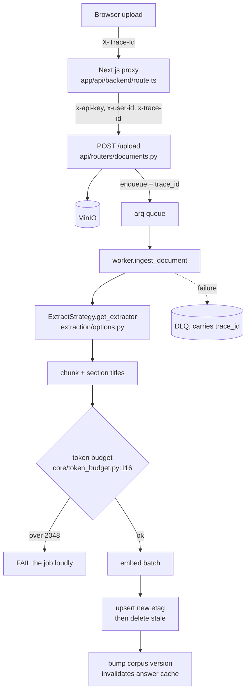
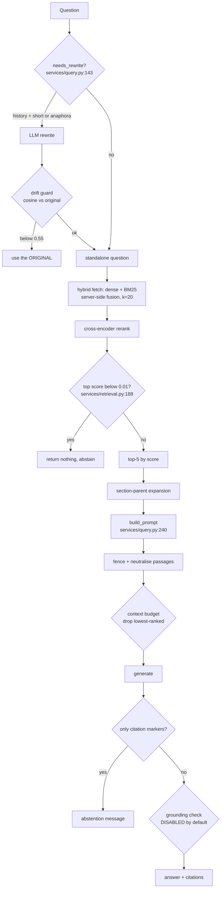

# KnowAll DocumentBot — Handoff

Written for someone who has never seen the work that produced it. Findings are
restated, not referenced by number. Every non-obvious claim cites `file:line`.
Anything undetermined says so, and says what would determine it.

`docs/REMEDIATION_LOG.md` is the chronological record with the evidence behind
each claim here. This document is the standing summary.

---

# 0. Retractions

An end-to-end audit (2026-08-10/11, `docs/FINAL_AUDIT.md`) tested this document
against a clean clone and a running stack. Six claims were **wrong**, not stale.
They are marked RETRACTED rather than silently updated, because a reader who saw
an earlier version needs to know the claim was false — not merely what the
number is now.

| claim | status |
|---|---|
| "ruff / mypy clean across 38 source files" | **NOW FIXED** (`3e86de6`) — the six real errors resolved with no ignores; mypy clean across 41 files in-container. **RETRACTED** — measured on a host venv missing `openai`, `qdrant_client`, `fastembed`, `arq`, `redis`, `minio`. With `ignore_missing_imports`, those collapse to `Any`. Host and container disagree with **zero overlap** (5 phantom errors, 6 real ones hidden). Separately, `.gitignore` hid `backend/models/` from ruff entirely. Never a statement about the codebase. Actual: **mypy 6 errors in 3 files**. |
| "CI green" / "what CI enforces" | **NOW FIXED** (`dd0e860`, `b07450b`, `bdfaa88`) — CI first executed 2026-08-11; 4 of 5 jobs green, the fifth red on a documented blocker. **RETRACTED** — CI had **never executed**. `origin/dock_contain` sat 69 commits behind at the `pre-refactor-streamlit` tag; nothing was pushed until this audit. Both static steps are also broken by their invocation: the mypy step exits 2 (`cannot read file 'backend/core'`), the ruff step reports 35 errors. "CI green" was a Phase 1 exit criterion that was never met. |
| "Run it in 10 minutes" (§4) | **STILL TRUE AS A RETRACTION** — §4 now states ~45 min and names the build step. **RETRACTED** — measured **~45 minutes**, of which **~43 is image build** (2576.7 s, with a *warm* layer cache; both backend images are 10 GB). The section never mentions a build step at all. |
| `scripts/alias_reindex.py` as a working zero-downtime reindex | **PARTIALLY ADDRESSED** (`e909236`) — the unreachable branch is deleted, an explicit pre-swap refusal added, `--drop-candidate` added. The swap still cannot complete; the bootstrap is proposed, not implemented (§12 q2). **RETRACTED** — **non-functional on any existing deployment.** The alias swap cannot complete where the collection was not bootstrapped alias-first. See §11 and FINAL_AUDIT P0-3. |
| Snapshot-based backup in `RUNBOOK-reindex.md` | **NOW FIXED** — the runbook uses a volume-level tar with a restore proof; verified by restoring 376 points into a throwaway Qdrant. **RETRACTED** — Qdrant writes snapshots to `/qdrant/snapshots`, which is **not mounted**. Snapshots did not survive `docker compose down`. `--verify` could not detect this because it restores within the same container lifetime. Use a **volume-level** backup. |
| Startup sweep "recovers" orphaned jobs | **STILL TRUE AS A RETRACTION** — behaviour unchanged and correct; only the wording was wrong. **RETRACTED** — it **fails** them, with `"Worker restarted while this job was in flight."` The user must re-upload. |
| **Finding #37** — the admission ceiling and its 8-request crossing | **NOW FIXED** (`1af91eb`) — replaced by a memory-derived ceiling of 1, enforced at startup against the real cgroup limit. **RETRACTED, not corrected.** The *derivation* was wrong: it sized `max_concurrent_queries` against `llm_read_timeout` alone and never asked what else could bind. **Memory binds, two levels earlier.** Every number it produced is unfounded — the 4 that shipped, the 8-request crossing, and the 6–7 derived from it. Measured replacement in `core/admission_limits.py`. |
| `/ready`'s remediation text | **NOW FIXED** (`6638061`) — `api/main.py` calls `ensure_ready`, so the promise is true; `/ready` also reachable through the proxy. **RETRACTED** — it said restarting the API calls `ensure_ready`. It did not; `ensure_ready` appeared nowhere in the API startup path, and its only occurrence under `api/` was inside that string. Restarting left `/ready` at 503; an **ingest** repaired it. Now made true rather than reworded: `api/main.py` calls it. |
| The trust/port guard as enforcing | **NOW FIXED** (`6638061`) — `KNOWALL_API_PORT_BINDING` is required and its absence fails closed. **RETRACTED** — it read `KNOWALL_API_PORT_PUBLISHED`, which nothing set (one mention, in a compose *comment*), so it passed on a genuinely published port. A container **cannot** observe host port publishing — measured, the socket view is identical either way — so the declaration is now required and its absence fails closed. |

Two further corrections that are amendments, not retractions:

- The prior citation audit reported a **10% drift rate**. That was the rate in a
  20-citation *sample* covering 80% of the population; the population rate was
  **8%**. A second audit re-resolved **all 25** citations: 25/25 correct.
- `max_concurrent_queries` — §2's "incumbent = 20" describes a configuration no
  artifact produces. `core/config.py:272` and `.env.example:73` both ship **4**,
  the candidate generator's number. See §2.

---

# 1. State of the system

## Is grounding on?

**No.** It is implemented, unit-tested, and **shipped disabled behind a flag**,
because enabling it on the generator that currently ships **destroys the
system's ability to answer at all**. Measured: the same 15 answerable questions
went from 13/15 answered to 2/15 when the grounding rule was added to the
prompt.

It works on a candidate generator that has not been adopted. That decision is
§2, and it has not been made.

## Shipped enabled

| what | where | behaviour |
|---|---|---|
| Abstention separated from relevance ranking | `services/retrieval.py:188` | One low bar decides "did retrieval return anything coherent"; ranking decides order. Previously one threshold did both and discarded correct answers. |
| Malformed-generation guard | `services/query.py:459` | A reply that is only citation markers (`[1] [1][3]`) becomes the abstention message instead of an empty bubble. |
| Query-rewrite drift guard | `services/query.py:172` | A rewritten follow-up whose meaning drifts from the original is discarded and the original used. |
| Prompt-injection containment | `services/passage_guard.py:96` | Retrieved passages are fenced, and fence/header/role/abstention-shaped text is stripped from their bodies. |
| Embedding + context token budgets | `core/token_budget.py:116,139` | An oversized chunk fails ingest loudly; an oversized prompt drops lowest-ranked passages. |
| Embedding-model identity enforcement | `core/model_identity.py:75` | Startup fails if the live model's digest differs from the pinned one. |
| Generation-model identity enforcement | `core/model_identity.py:122` | Same, for the generator. |
| Payload-index readiness | `api/routers/system.py` `/ready` | Returns 503 listing any missing index rather than serving silently-degrading queries. |
| Config coherence checks | `core/startup_checks.py` | Refuses to start on an unset/placeholder API key, or trusted proxy identity with a published port. |
| Vendored OCR language data | `api/Dockerfile`, `vendor/tessdata/` | Checksummed and build-gated, so OCR output cannot move without a diff. |
| Trace propagation | `core/tracing.py` | One id from browser to worker log to dead-letter queue. |

## Shipped disabled behind a flag

| flag | default | what flipping it does |
|---|---|---|
| `require_support_quotes` (`core/config.py:135`) | `False` | Requires the generator to quote a supporting sentence per citation, verified by string match. **On the shipped generator this collapses answering from 13/15 to 2/15.** Viable only on a generator that can satisfy an output contract. |
| `llm_enable_thinking` (`core/config.py:82`) | `False` | Lets a reasoning-capable generator emit chain-of-thought. Measured: with reasoning on and a structured prompt, 4383 characters of reasoning consumed the entire token budget and the answer came back **empty**, with the request reporting success. |
| `contain_untrusted_passages` (`core/config.py:146`) | `True` | Turning it **off** reproduces pre-containment prompt assembly byte-for-byte, dropping both the fences and the system-prompt clause. Measured cost of leaving it on: none, on either generator. |
| `rerank_score_floor` (`core/config.py:229`) | `0.0` (off) | Raising it to `0.25` restores the old per-chunk relevance cut. That value discarded correctly-ranked first-place answers; a test pins the old behaviour, so this is a config difference rather than a lost capability. |
| `digest_enforcement_from` (`core/config.py:101`) | set in compose | When set, a stored point with no embedding-model digest is **fatal** rather than "unknown". |
| `expected_embed_model_digest` / `expected_llm_model_digest` (`core/config.py:55,90`) | `None` | Unset = loud warning, drift undetectable. Set = hard fail on mismatch. |
| `trust_proxy_identity` (`core/config.py:275`) | `True` | Believes `X-User-Id` from callers. Safe only while the API port is unpublished; startup refuses the incoherent pair. |

## Measured, deliberately not changed

- **`parent_char_budget` × `rerank_top_n`** produce an almost fixed-size prompt
  — the upper mode spans 4% (5140–5375 tokens). Cutting it is a latency lever,
  but it trades against retrieval quality and only an eval can settle that.
- **Five payload fields** (`key`, `chunk_index`, `total_chunks`,
  `content_type`, `image_count`) are write-only or superseded. Dropping them
  only takes effect on reindex, so it is a data migration; it should ride along
  with a reindex that is happening anyway.
- **The abstention and concision rules in the system prompt cost ~2–3 answers
  in 15.** Changing the generation prompt was out of scope without approval.

## Untouched

- The cross-encoder reranker's behaviour (`BAAI/bge-reranker-base`).
- Chunk size, overlap, embedding model, distance metric.
- The retrieval algorithm: hybrid dense + sparse, server-side fusion, rerank.
- The frontend, beyond a two-line header pass-through in the proxy.
- Tier A corpus — **does not exist**.
- Tier C corpus — **planned, never built** (§11).

---

# 2. The generator decision

The largest open item. **Nothing has been switched.** `ollama_llm_model` still
defaults to `llama3.2:1b` (`core/config.py:70`).

## Why it is on the table

Three measurements against the shipped 1B generator. They are not three
separate defects — they are **one property measured three ways: it cannot be
relied on for instruction-following that is not answering the question.**

| measurement | result |
|---|---|
| The system prompt tells it to reply with an exact abstention string when the context lacks the answer | **0 of 4** near-miss questions declined |
| Any yes/no verdict framing | **"NO" is a fixed token, not a decision** — it answered NO to *"The sky is blue."* against the passage *"The sky is blue."*, and still answered NO when the labels were inverted so that YES meant "contradicts" |
| A structured output contract (quote a supporting sentence per citation) | answered questions dropped **13/15 → 2/15** |

The model reads passages correctly — it answers open questions accurately from
context. What it will not do is follow an instruction *about its own output*.

**That forecloses prompt-level grounding entirely.** A differently-worded rule,
a different verdict vocabulary, a looser format — all the same bet on the same
property. Do not spend a cycle on a fourth variant.

## The package — four coupled consequences

These move **together**. Read separately, a maintainer could pick an incoherent
combination: the candidate at concurrency 20 admits roughly five times what its
timeout tolerates; the incumbent at concurrency 4 throttles a model that
answers in seconds.

| | incumbent `llama3.2:1b` | candidate `qwen3.5:4b` |
|---|---|---|
| ollama container limit | 6 GiB sufficient | **8 GiB** — 6 was 98% consumed (5.90/6.0) at cold model load *while serving concurrent requests* |
| `max_concurrent_queries` | 20 (crossing far higher) | **4** — worst-case full-context latency crosses the 300 s read timeout at concurrency 8 |
| warm full-context latency | seconds | **~48 s** single-shot; ~62 s at concurrency 2 |
| grounding | **cannot be enforced** | abstention fires 3/4; verdict controls 5/5; quote emission 15/15, verified 14/15 |
| `require_support_quotes` | must stay off | **viable** — a default flip, no code change |

## What changed unconditionally, and what to revert

Changed because both are defects on **any** generator:

- **Ollama runtime 0.9.3 → 0.32.5**, pinned by digest
  (`docker-compose.yml:61`). Required to pull the candidate at all — it returns
  HTTP 412 on 0.9.3. The embedding vectors survived the upgrade: digest
  unchanged, cosine deviation `1.292e-07`, which is floating-point noise rather
  than re-quantization.
- **`max_concurrent_queries` 20 → 4** and the **container limit 6 → 8 GiB**.

> **If the incumbent is kept, revert the concurrency and memory changes.**
> They are sized for the candidate; leaving them throttles and over-provisions
> a model that is not running.

## The three options

1. **Accept documented ungrounded output.** Cheapest. Measured: 8 of 10
   unanswerable questions leak past retrieval, and 0 of 4 near-misses are
   caught by generation. Requires telling users.
2. **Add an entailment model.** The only remaining candidate that catches a
   claim which quotes truthfully and reasons wrongly from the quote. Three
   unmeasured risks: a small NLI model on French, at ~5000-token passages, in
   the container budget — plus a new-dependency decision.
3. **Adopt the candidate generator**, accepting the package above.

---

# 3. Method note — how these findings were produced

Five practices. They matter more than the results, because the next person will
be in the same position.

## 0. The auditor reproduced the bug five times while auditing for it

Stated first because it governs how to read everything else. The 2026-08-10/11
audit was performed by the same author as the work it audited. **Five of its own
checks were defective**, each in the exact way the thing under test was suspected
of being:

| # | the defective check | what it produced |
|---|---|---|
| 1 | ran `ruff`/`mypy` on a host venv missing 7 backend deps | 5 phantom errors, 6 real ones hidden — **zero overlap** with the truth |
| 2 | piped `ruff` through `tail` and read `$?` | `EXIT=0` from a run that found 35 errors — the engagement's own `ruff \| tail` defect |
| 3 | planted a second model snapshot in the huggingface tree, not the fastembed tree the checker reads | "guard did not fire" — the guard was fine |
| 4 | forced the new gitignore guard by un-anchoring the patterns, with the files already committed | test passed; `git ls-files --others` reports only **untracked** files |
| 5 | ran the eval without `-e QDRANT_COLLECTION=knowall_eval` | **every retrieval metric 0.0** — queried the production corpus against a tier-B golden set |

**The fifth is the generalisation, and the danger is symmetric.** Failures 1–4
produced results that looked *right*; failure 5 produced one that looked
*catastrophically wrong*. A plausible catastrophe gets escalated exactly as
readily as a plausible success gets banked — and 0.0 across every metric would
have been reported as a total retrieval regression had it not been checked.

Note the shape: **five omissions or misapplications of a documented environment
variable or invocation, each yielding a legible but wrong number.** This is the
same failure as the `OLLAMA_LLM_MODEL` omission earlier in the engagement. The
defence is not that the operator remembers — it demonstrably does not, five
times over. The defence is that **every recorded measurement states its full
invocation**, so a wrong number can be traced to a wrong command instead of
being attributed to the system.

**1. Measure before tuning.** The original audit rated the rerank threshold's
risk *mitigated*. An eval baseline showed retrieval found the correct chunk for
**every** answerable question while only a third survived into the final answer
— the entire quality gap was after retrieval. Code review had looked at that
threshold and approved it.

**2. Test a guard by forcing its failure condition.** A guard nobody has seen
reject anything is indistinguishable from one that does nothing. Four guards
here passed their own tests while doing nothing:

- a model-pin verifier asserted the pinned file *existed* — which the download
  guarantees on its own;
- an identity test set an environment variable in the shell, which Docker
  Compose never passes into containers, so the "passing" test exercised
  nothing;
- a rewrite guard checked emptiness and length but not content, and passed a
  fluent rewrite about a different subject;
- 17 grounding tests were **green while the mechanism measured 0/15** — they
  fed well-formed input to the parser and never asked whether the generator
  could produce it.

**3. If a metric improves as load increases, the measurement is contaminated.**
Two artifacts, both caught by the shape being impossible rather than by care:

| observed | cause |
|---|---|
| concurrency 1 → 218.5 s, concurrency 2 → **19.0 s** | every call used an identical prompt; the inference server's prefix cache served the prefill |
| concurrency 4 → 332.7 s, concurrency 5 → **208.4 s** | level 4 ran first from an unloaded model, so its time included a cold load |

So: **never benchmark with a fixed prompt**, and **discard the first
measurement of any series**.

**3b. Before reading a metric as improved, confirm its population did not
change.** The general case of practice 3, and the one this engagement hit most
often — **three distinct instances of a metric improving because its population
got easier, not because the system did**:

| observed | the population that changed |
|---|---|
| `correct_abstention_rate` **1.000** while the system abstained on **68%** of answerable questions | measured over unanswerable entries alone; a system that answers nothing scores perfectly |
| latency **fell** as concurrency rose (218.5 s → 19.0 s; 332.7 s → 208.4 s) | the *work* got easier — prefix-cache hits, then a warm model |
| `hit_at_k` **0.682 → 0.867 (+0.185)**, reported as no regression | `n_answerable` fell **22 → 15**; seven history-bearing entries were retagged full-mode-only and skipped. They are plausibly the harder cases, so removing them raised the rate mechanically |

The first two were caught by an impossible shape. **The third was not** — the
comparator, the instrument built to prevent exactly this, printed *"OK — no
metric regressed."* Its drift detection covered every config knob and not the
size of the denominator.

Now fixed: `n_answerable` and `n_unanswerable` are **HARD** provenance fields
(`eval/provenance.py`), so a golden-set composition change is **INCOMPARABLE**
rather than a silent gain. Verified against the real case — the comparison that
produced the +0.185 now exits 2 with `REFUSING TO DIFF`. A control test
confirms an unchanged population still compares, so the guard cannot pass by
refusing everything.

**A rate is a fraction. Check the denominator before you read the numerator.**

**3c. Do not measure a resource under the constraint you are trying to size.**
Memory was profiled against the *existing* 3 GiB limit and appeared to converge
at 2.99 GiB — "allocator arenas, not a leak". Raised to 5 GiB, the same workload
climbed to **3.87 GiB** and converged there instead. The plateau was the
CEILING, not the workload: pressed against the limit, the allocator had no room
to expand and had to reuse.

Nothing looked wrong, which is what separates this from practice 3 — there is no
impossible shape to catch it on. The number was real, reproducible and precise,
and it answered a different question than the one asked. **When sizing a limit,
measure with the limit removed or generously raised**, then size to what you
observe.

**3d. Every resource number is an assumption until something forces a
measurement.** Three instances, and the third is what generalises it:

| number | basis | measured |
|---|---|---|
| `max_concurrent_queries=4` | derived for a candidate generator | 1 fits |
| ollama `8g` | derived for the same unadopted candidate | 2.68 GiB |
| worker `4g` | **nothing at all** | 137 MiB peak |

The first two share a cause — values correct for `qwen3.5:4b`, shipped with a
generator never adopted. The worker's has no such excuse: it was simply a
number. Together they declared **15.5 GiB against an 11.68 GiB host**, which
worked only because nothing approached its limit — a condition that expires
silently. Audit every resource number for what produced it; "it has always been
that" is not a basis.

**4. Confirm a number measures the thing its threshold applies to.** A script
reported *16 chunks over the 2048-token embedding limit*. The count was
correct; the quantity was wrong — those were chunks *after context expansion*,
and the limit applies to the chunk *as stored*, which is never re-embedded. It
arrived **maximally credible because it confirmed a finding already in the
backlog**. A number that agrees with what you expect gets less scrutiny, not
more. Same units is not the same object.

**5. Having a rule written down is not the same as reaching for it.** The
Dockerfile broke twice on embedded multi-line shell during this work — the
second time *after* the fix (move it into a real script file) had already been
applied elsewhere in the same file and written into this document. Practice 2's
list was likewise written down before its fourth instance was introduced.
Expect to reintroduce known failures. The defence is a test that forces the
condition, not vigilance.

---

# 4. Run it in about 45 minutes

> **RETRACTED: "10 minutes."** Walked against a clean clone on 2026-08-10 and
> re-verified after R1–R3. Numbers below are measured, not estimated.

| step | measured | note |
|---|---|---|
| `docker compose build` | **2576.7 s (~43 min)** — see note | with a **warm** Docker layer cache; a cold cache is slower. Backend images are **3.68 GB** each (api and worker are byte-identical, so the pair costs ~3.7 GB, not 7.4). |
| `docker compose up -d --wait` | 35.1 s | 7/7 services healthy |
| `ollama pull nomic-embed-text` | 1.5 s | implausibly fast; the volume was fresh and the write real, but a fast link or CDN cache could not be ruled out. **Treat as a lower bound.** |
| `ollama pull llama3.2:1b` | 1.3 s | same caveat |
| first query | ~106 s | full context, cache defeated, on the production corpus |

> **The 3.68 GB figure is current; the 43-minute figure is not re-measured.**
> The images were 10 GB when this table was written. `8f65a0e` removed 3.1 GB of
> duplicated reranker weights (`PRUNING_PROPOSAL.md` R-1), and the size above was
> measured after it.
>
> The build time was **not** re-measured under the same conditions. The two
> rebuilds since took 35m46s and ~35m, both with the model layer **cold** — the
> opposite of the warm-cache condition this row states. A cold-layer build now
> downloads 3.1 GB less, so the true warm-cache figure is probably lower, but
> "probably lower" is not a measurement and is not written here.

**The build step is not in the commands below and dominates the time.**
`up -d` performs it implicitly. That omission is why "10 minutes" survived so
long: nobody counted the part that takes 43 of the 45.

**Undocumented knowledge you will otherwise need:**

1. On failure, compose reports only
   `dependency failed to start: container knowall-api is unhealthy`. The real
   reason needs `docker compose logs api`.
2. **A fresh clone is not a clean room** — every volume in
   `docker-compose.yml` carries a global `name:`, so a second checkout on the
   same host silently reuses the first one's volumes and models. Full entry,
   including why a routine `docker volume prune` destroys the production
   collection: **§11, P1**.
3. `MAX_CONCURRENT_QUERIES` must fit the api container's memory limit or startup
   refuses — deliberately. See §12 q1: the shipped value is **1**.
4. **Rebuild every service** before any end-to-end claim. A partial rebuild is a
   mixture of two commits and behaves plausibly enough to be mistaken for a
   regression.

```sh
cp .env.example .env
# Replace every REPLACE_ME_BEFORE_ANY_DEPLOY. The API refuses to start on the
# placeholder (core/startup_checks.py) — that is deliberate, not a bug.

docker compose up -d --wait
docker compose exec ollama ollama pull nomic-embed-text
docker compose exec ollama ollama pull llama3.2:1b

# Open http://localhost:3000 — the API port is bound to loopback on purpose.
```

Local development without credentials:

```sh
KNOWALL_INSECURE_DEV_MODE=i-understand-this-disables-authentication
```

Deliberately verbose, and it logs a banner on every startup. A quiet boolean is
what gets set in production and forgotten.

**The first query is slow** — the reranker and the generator both load on
demand. Cold start to first generation measured at 23.5 s.

---

# 5. RAG fact sheet

| | value | where |
|---|---|---|
| Embedding model | `nomic-embed-text:latest`, 768-dim | `core/config.py:50,65` |
| Embedding truncation | **silently truncates at 2048 tokens** — returns HTTP 200 with a well-formed vector built from a prefix | guarded at `core/token_budget.py:116` |
| Generator | `llama3.2:1b`, `num_ctx=8192`, `num_predict=1024`, `temperature=0.1`, **no seed** | `core/config.py:70-75` |
| Sparse leg | `Qdrant/bm25`, revision-pinned | `api/Dockerfile` |
| Reranker | `BAAI/bge-reranker-base`, revision-pinned | `api/Dockerfile` |
| Vector store | Qdrant; named dense + sparse vectors, int8 quantization, server-side fusion | `integrations/qdrant_store.py` |
| Chunking | 550 chars, 100 overlap; tables 1600 chars / 30 rows | `core/config.py:42-45` |
| Retrieved | `retrieval_fetch_k=20` → rerank → `rerank_top_n=5` | `core/config.py` |
| Context expansion | section-parent, `parent_char_budget=4000` | `services/retrieval.py:88` |
| Assembled prompt | median **5140 tokens**, max 5375, against an 8192 budget | `scripts/prompt_distribution.py` |
| Point IDs | `uuid5(source:etag:chunk_seq)` — stable, idempotent | `integrations/qdrant_store.py` |

`docs/rag_fact_sheet.yaml` carries the machine-readable version.

**Nominal chunk budgets understate real size by ~2×**: 550-char chunks and a
1600-char table budget have produced **2991-char** stored chunks, because
section prefixes and table row-groups stack on top of the nominal budget.

---

# 6. The two paths

## Ingestion



The upsert-then-delete order is the **staged cut-over**: every new-etag point is
written before any old one is removed, so a crash leaves either version fully
queryable and never a gap.

## Query



---

# 7. Where to change what

| to change | edit | then |
|---|---|---|
| a threshold or flag | `core/config.py` + `.env.example` | add it to the provenance tuple if it affects retrieval (`eval/provenance.py:63`) |
| retrieval behaviour | `services/retrieval.py` | re-run the retrieval eval; it is deterministic, tolerance zero |
| prompt assembly | `services/query.py:240` | passages are untrusted — see `services/passage_guard.py` |
| the system prompt | `services/query.py:36` | **two clauses are separately sanctioned**; a test pins that nothing else was added |
| extractors | `extraction/` | `section_title` matters — see the 43% coverage floor in §11 |
| a Qdrant filter | `integrations/qdrant_store.py` | **the field must be in `REQUIRED_PAYLOAD_INDEXES`** — a static test enforces it |
| the embedding model | anything | requires a reindex. **NOT** `scripts/alias_reindex.py` — its swap is non-functional on existing deployments (§0). Use in-place `scripts/reindex.py`, **with downtime**. |

---

# 8. Invariants — do not break these

1. **Point IDs are `uuid5(source:etag:chunk_seq)`.** This makes ingestion
   idempotent and reindexes re-runnable. Changing the recipe orphans every
   existing point.
2. **Upsert new, then delete stale.** Reversing it creates a window with no
   queryable version.
3. **Every field used in a Qdrant filter must be indexed.** Otherwise the query
   full-scans and degrades silently as the corpus grows. Enforced by a static
   test that parses both lists out of the source.
4. **The eval corpus never shares a collection with real documents.**
   `eval/ingest_corpus.py` refuses the default collection outright.
5. **Full-mode eval requires the answer cache disabled.** The harness refuses
   to start otherwise.
6. **Asymmetric embedding prefixes** (`search_document:` / `search_query:`) and
   the cosine/model pairing are load-bearing. Do not "clean them up".
7. **Filters go inside the prefetch legs**, not after fusion.
8. **A trace id is never an identity.** It is browser-supplied and
   attacker-controlled: correlation only — never authorisation, cache key, or
   partition key.

---

# 9. Evaluation

## Running it

```sh
# deterministic, no LLM, tolerance zero
docker compose exec -e QDRANT_COLLECTION=knowall_eval api \
  python eval/run_eval.py --mode retrieval --runs 3

# LLM in the loop; refuses to run with the answer cache enabled
docker compose exec -e QDRANT_COLLECTION=knowall_eval \
  -e ENABLE_ANSWER_CACHE=false api \
  python eval/run_eval.py --mode full --runs 3
```

For a baseline anyone may later diff, pass the identity the container cannot
discover for itself:

```sh
-e KNOWALL_GIT_SHA=$(git rev-parse HEAD) \
-e KNOWALL_API_IMAGE_ID=$(docker inspect -f '{{.Id}}' knowall-documentbot-api)
```

## Reading it

- **Two abstention rates, never one.** `false_abstention_rate` (answerable
  questions that returned nothing — lower is better) and
  `correct_abstention_rate` (unanswerable questions that correctly returned
  nothing — higher is better). A single combined number read 1.000 on a run
  that abstained on 15 of 22 **answerable** questions.
- **Tiers are never averaged.** Tier B is deliberately adversarial.
- **`recall_at_fetch = 1.000` on tier B is arithmetic**, not quality: 18 chunks
  against `fetch_k=20` returns the whole corpus every time.
- **`mrr_at_k` is the retrieval-quality number**, not `hit_at_k`. Returning
  five chunks instead of one raises `hit_at_k` mechanically.

## Variance, and its three qualifications

Retrieval mode is genuinely deterministic: **0.0 spread across six passes on
two separate container builds.**

Full mode also measured **0.0 spread** — and that is **not** evidence of
stability. The generator is provably non-deterministic (3–5 distinct outputs in
10 calls at temperature 0.1). Zero spread is consistent with three different
explanations:

1. the pipeline genuinely did not vary;
2. the metric was too coarse to register it — at the time, results never
   exceeded one item, so `mrr_at_k` and `hit_at_k` carried one bit between
   them;
3. part of the work was served from the inference server's **prefix cache**,
   which disabling the answer cache does not disable.

> When full-mode variance is re-measured, **restart the ollama container
> between runs.** Otherwise the result needs three qualifications and is worth
> less than the run costs.

## What CI enforces

**First executed 2026-08-11.** Before that it had never run: 69 commits were
unpushed, so every prior "CI green" claim was a statement about a workflow file.
That retraction stands; what follows is what has actually happened since.

| job | executed? | now |
|---|---|---|
| Frontend build + types | yes | **green** |
| Backend lint + types + unit tests | yes | **green** |
| E2E (compose + Playwright) | yes — first ever run 2026-08-11 | **green** |
| Image scan (report, never gates) | yes — first ever run | **green**, publishes the CVE list as an artifact |
| Dependency gate (application layer) | yes | **red**, on one documented blocker |

**What the first runs caught**, none of which any local check had surfaced:

- the ruff step's `--config` invocation, producing 35 phantom import-sort errors
- the mypy step's working-directory defect — `cannot read file 'backend/core'`,
  exit 2, so that step had never completed
- `trivy-action@0.28.0`, a version that has never existed, failing at "Set up
  job" two layers behind a gate that could never pass
- **22 HIGH CVEs** in pinned Python dependencies. 9 cleared
  (`7017bee`, `5e34c08`, `8914f8c`); 13 remain, all `pillow`, blocked by
  `fastembed==0.7.1` requiring `pillow<12.0.0` — moving it means moving the
  SHA-pinned reranker, which is R5 rather than a CI fix.

The scan and the gate are deliberately **separate jobs**: a HIGH in a hash-pinned
Python dependency is fixable in a commit, while a HIGH in a transitive Debian
package needs a base-image digest bump that moves tesseract, OCR output, corpus
content and every eval baseline. One boolean over both would either block on
something no commit can fix, or invite softening the gate on its first execution.

`.github/workflows/eval.yml` remains as before: corpus-manifest integrity,
embedding-model identity, golden-set schema, rewrite-branch agreement and
retrieval determinism on PRs; nightly full mode reporting spread without gating.

**Metric-regression comparison is ACTIVE. The gate has a reference.**

It did not, for most of this engagement. All four older baselines predate the R4
provenance fields, so the comparator correctly **refused to diff** any of them —
a baseline that never recorded its denominators cannot be shown to measure the
same population — and the gate was configured, correct, and **referenceless**.
Recording a fresh one was blocked on the eval corpus being uningestible.

Both are recorded, and both are *references* rather than diagnostics: 46
provenance fields, none `"unknown"`, none `"unpinned"`.

| | `tier-b-retrieval-2026-08-14` | `tier-b-full-2026-08-14` |
|---|---|---|
| runs / tolerance | 3 / 0.05 | 2 / 0.10 |
| n answerable + unanswerable | 13 + 9 | 19 + 9 |
| recall@fetch | 1.000 | 1.000 |
| hit@k · mrr@k | 0.846 · 0.846 | 0.789 · 0.789 |
| false / correct abstention | 0.154 / 0.222 | 0.211 / 0.222 |
| spread across runs | 0.000 | 0.000 |

**Read these as a new zero, not as a delta.** They are not comparable to any
earlier number and the comparator says so: the corpus manifest hash moved, and
the population changed by construction when the b04-dependent entries were
dropped. An "improvement" measured against an August 3–5 file would be a
population artefact (R11).

**The gate is tested, not merely present.** All three outcomes were forced:

    reference vs an independent repeat run  -> COMPARABLE,   exit 0, deltas 0.000
    reference vs a pre-R4 baseline          -> INCOMPARABLE, exit 2
    reference vs a planted -0.246 hit@k     -> FAIL,         exit 1

The first of those had never been run before. A reference nobody has diffed is a
reference nobody has tested.

*Two caveats that survive.* Tier B is synthetic and adversarial, so these are not
a headline quality number — they are a **change-detector**, and that is all they
are claimed to be. And the 0.000 spread is a property of temperature 0 on a small
set, not a general claim; the tolerances stay as recorded because a real corpus
will not be deterministic.

---

# 10. Findings, restated

## Fixed

**The evaluation corpus could not be ingested by the code that ships.** The
fixture authored to prove finding #19's oversized-row path was *reachable* was
then refused by the guard built for #19 — both correct, and mutually exclusive.
It survived unnoticed because the eval collection was never rebuilt from
scratch after the guard landed, so **every committed baseline had been produced
against a collection today's code could not create**.

`b04-wide-row.csv` now carries `ingest: false` in `MANIFEST.yaml`: verified,
hashed and byte-pinned like every other document, but never embedded. It is part
of the corpus *definition* and not of the *index*. It stays because it is the
only artefact proving that boundary is reachable on a real file — every other
token-budget test uses text this repository invented to be too long, which
proves the check works rather than that anything triggers it.

*The consequence the proposal missed.* Four golden entries depend on that
document, and scoring them against an index that lacks it would have corrupted
the very baseline the work existed to produce: two answerable entries (three in
full mode) become guaranteed false abstentions, and the unanswerable *"how many
days notice for CT-9002?"* — authored as a near miss against b04's CT-9001 —
degrades into a freebie that inflates `correct_abstention_rate`. `run_eval.py`
now drops entries whose required documents are not indexed, **derived from the
manifest** rather than from a list, so what is indexed and what is scored cannot
drift apart. The population change is therefore visible in the hard denominators
rather than silent.

*What this did not decide.* Whether row-based chunking should split oversized
rows — that is question 3 in §12, and it is untestable until a corpus of real
wide tables exists. `eval/ingest_corpus.py`, `eval/corpus/verify.py`,
`tests/unit/test_token_budget.py`.

**The rerank threshold discarded correct answers.** One number decided both
"is anything relevant" and "which is most relevant". A correctly-ranked
first-place answer scoring 0.16 was thrown away because the bar was 0.25 — and
because a cross-encoder's absolute score tracks chunk *shape* (prose vs table
vs OCR) as much as relevance, it fell hardest on tables and scanned pages. Now
split into a very low abstention bar plus ranking. `services/retrieval.py:188`.

**Query rewrites could silently change the subject.** The guards caught
exceptions, empty output and gross length — but not meaning. A
records-retention follow-up came back as *"What is the policy on disposing of
hazardous waste?"*: fluent, correctly sized, past every check. Now guarded by
cosine similarity to the original, in the same space retrieval scores in.
`services/query.py:172`.

**The generator emitted citation markers with no prose.** `[1] [1][3]` and
nothing else — not an answer, not an abstention, and it passed every check
because it was non-empty, correctly sized and cited. Now treated as a failed
generation. `services/query.py:459`.

**Retrieved passages were untrusted input in the same channel as the
instructions.** Now fenced, with fence-, header-, role- and abstention-shaped
text stripped from bodies — because a fence a poisoned chunk can close is
decoration. `services/passage_guard.py:96`.

**Vectors carried no record of which model produced them.** A republished model
tag would have left a collection silently mixing two embedding spaces. Every
point now records model and digest, and a marker makes "no digest" fatal rather
than permanently ambiguous. `core/model_identity.py`, `scripts/reindex.py`.

**The reindex enumerated the wrong source.** It listed the object store, which
held 7 more objects than the collection had sources — a "migration" would have
quietly *added* documents. Now driven by the collection.

**`etag` was filtered on every ingest and never indexed**, so the staged
cut-over full-scanned every time. Now indexed, with a static test enforcing the
general rule. `integrations/qdrant_store.py:376`.

**Admission control admitted ~3× what the timeout tolerates.** Requests past
the crossing were accepted only to time out — worse than the 503 the semaphore
already returns when full. `core/config.py:272`.

**OCR language data was unpinned.** The base-image digest pinned the tesseract
binary, not the language models; a refresh would have changed OCR output —
which is corpus content — with no diff anywhere. Now vendored, checksummed and
build-gated.

**A published API port with trusted proxy identity**, an unset API key silently
disabling authentication, and functional credentials in the shipped example
file. All three now refuse to start. `core/startup_checks.py`.

**Build reproducibility**: base images pinned by digest, model revisions
asserted at build time, embedding and context token budgets enforced, trace ids
propagated end to end, and `CORPUS_VERSION_KEY` moved out of a peer service.

## Shipped disabled

**Quote-backed grounding.** Correct, tested, and off — see §1 and §2.

## Measured and deferred

**Prompt size is nearly constant on the answering path** (4% spread), so
latency is predictable and only the budget itself is a lever. **Five payload
fields are droppable**, but only on a reindex. **The abstention and concision
prompt rules cost ~2–3 answers in 15.**

## Incorrect as filed

**"The embedding leg and the reranker see different text."** Disproved:
ingestion embeds and stores the same string, and the reranker scores that
string. What is real is different — a *provenance header* the model reads as
part of the passage, and no section metadata at all on PDF chunks.

**The 2048-token embedding boundary as an active data loss.** It is **not
currently crossed** — the largest stored chunk is ~1056 tokens. It is a
regression guard, not a rescue.

---

# 11. Not fixed — and what each would take

**P1 — OPERATIONAL: every compose project built from this file shares one set of
volumes, so `docker volume prune` destroys the production collection.**

`docker-compose.yml` declares its volumes with an explicit `name:` and **no
project prefix**:

```yaml
volumes:
  qdrant_data:
    name: qdrant_data          # NOT knowall-documentbot_qdrant_data
```

Compose normally namespaces volumes per project. `name:` overrides that. Two
consequences, and the second is the dangerous one:

**1. A fresh clone is not a clean room.** A checkout in a different directory is
a different compose project, but it binds the *same four volumes*:
`qdrant_data`, `minio_data`, `ollama_data`, `redis_data`. It silently reuses the
first checkout's volumes **and models**. Any `up` in a second working tree
mounts the live production data, and any `down -v` there destroys it. This is
the retroactive explanation for why the audit's clean rooms had to have their
volumes backed up and restored by hand — that was not caution, it was the only
thing standing between a clean-room run and the real collection.

**2. A routine prune is destructive.** There are **271 dangling volumes** on the
reference machine and the live ones are not distinguishable from the dead ones
by naming convention — they carry no project prefix to sort on. `docker volume
prune`, `docker system prune --volumes`, and `docker compose down -v` from any
clone are all one keystroke from deleting `qdrant_data`.

**Mitigations, in order of what they cost:**

| | |
|---|---|
| **today, free** | Never run a blanket volume prune. Remove volumes by explicit name. Never `docker compose down -v` outside the primary tree. Take a snapshot first: `scripts/snapshot.py`. |
| **cheap, partial** | Set `COMPOSE_PROJECT_NAME` per checkout. Does **not** fix it on its own — `name:` still wins — but it makes containers and networks unambiguous while the volumes are being sorted out. |
| **the real fix (R5)** | Drop the `name:` overrides and let compose namespace them, or prefix them explicitly (`knowall_qdrant_data`). |

**Not implemented, deliberately.** Renaming a volume does not move the data —
it **orphans it**. The existing `qdrant_data` would be left unreferenced (and
indistinguishable from the 271 others) while the stack came up against a new,
empty volume. Doing it safely means: snapshot, rename, restore into the new
volume, verify point counts, then delete the old one by name. That is a data
migration under R5, not a compose edit. *Would take:* the migration above, plus
a decision on whether existing deployments are expected to follow it.

**The rerank score measures topical relevance, not answer presence.**
Near-miss questions — where the corpus covers the topic but not the fact —
score **0.70–0.997**, higher than most correct answers. No absolute threshold
separates "about your question" from "answers your question", because the model
is not measuring the second thing. Reproduced on both the synthetic corpus and
the real one. *Would take:* an entailment model, or accepting it.

**The generator does not decline on near-misses.** 0 of 4 on the shipped model.
Same root as the above, different layer. *Would take:* the decision in §2.

**An entailment check.** The only remaining candidate for the case where a
model quotes truthfully and reasons wrongly from the quote — the benchmark
being a French passage stating a *deadline*, rendered by the model as an
*entitlement*. *Would take:* measuring a small NLI model on French, at
~5000-token passages, inside the container budget; plus a new-dependency
decision.

**Tier A corpus.** Real documents with a manifest and checksums. Everything
about behaviour on real-world document composition is currently assumed.
*Would take:* sourcing licensed documents — the infrastructure to manifest and
ingest them already exists.

**Phase 1A** — ≥60 golden entries drawn from real documents, and activating the
metric-regression CI gate. *Blocked on tier A.*

**Phase 3 ordering experiments** — gap-based keep-criteria, per-query score
normalisation, enriching what the reranker sees. *Would take:* a corpus where
ranking has headroom. On the synthetic corpus the reranker already places the
correct chunk first in every case where it retrieves it at all (15/15).

**Tier C corpus — planned and never built.** The idea was to use this
repository's own documentation as a corpus with real prose and genuine
near-duplicate content across sessions, to get *competing* retrieval candidates
without needing human-authored questions.

The evidence for whether ordering experiments have anywhere to run points two
ways, and both halves matter:

| corpus | `mrr_at_k` vs `hit_at_k` | reading |
|---|---|---|
| synthetic tier B, 18 chunks | **identical** (0.682 / 0.682) | no ordering headroom — the reranker places the correct chunk first in every case it retrieves it at all, 15/15 |
| ad-hoc 376-point collection, real prose | **diverged: 0.897 vs 0.952** | headroom exists; ranking is imperfect and therefore improvable |

> So the hypothesis is **supported by the probe and never tested on anything
> reproducible.** The divergence was seen on a collection with no manifest and
> no checksums, so it cannot back a baseline or a regression gate. That is a
> narrower gap than "untested": the question is not *whether* a corpus with
> real prose produces competing candidates — one did — but whether a
> *reproducible* one can be built that does.

*Would take:* manifesting and checksumming `docs/` the way the synthetic corpus
is, ingesting it into its own collection, and running that single divergence
measurement before authoring any questions against it.

**Five payload fields.** *Would take:* a reindex.

> **RETRACTED: "which `scripts/alias_reindex.py` now makes safe."** The alias
> reindex is **non-functional on any existing deployment** — the swap cannot
> complete where the collection was not bootstrapped alias-first (Qdrant refuses
> an alias colliding with a real collection: `409 … already exists!`).
>
> **This invalidates the premise of several deferrals**, each of which was
> deferred on the assumption that a safe reindex path existed: these five
> payload-field drops, the cross-encoder enrichment in §11, and **any future
> embedding-model, chunk-size or distance-metric change**. Re-examine all of
> them against the path that actually works today: in-place
> `scripts/reindex.py`, **with downtime**.

**The abstention and concision prompt rules' cost.** ~2–3 answers in 15, and
the abstention rule delivers none of its intended benefit on the shipped model.
*Would take:* two runs to isolate which of the two rules costs what, then a
prompt decision.

**`section_title` covers 162 of 376 points.** PDFs — 214 points, the majority —
carry none, because per-page sections would be singletons. *Any* filter or
routing on that field silently excludes most of the collection. *Would take:* a
PDF-specific answer, such as document title or heading detection.

---

# 12. Open questions for a maintainer

Each is answerable without reading the rest of this document.

**1. The generator: adopt `qwen3.5:4b`, accept ungrounded output, or fund an
entailment model? — AND can the system serve more than one user at a time?**

This question has two halves now, and the second was not visible when it was
first written.

*Grounding.* The shipped generator (`llama3.2:1b`) cannot be made to ground its
answers — it ignores the instruction to decline when the context lacks an answer
(0 of 4 near-miss questions), cannot be steered into a yes/no verdict, and
collapses from 13/15 to 2/15 answered when asked for structured output. The
candidate fixes all three. Nothing has been switched.

*Concurrency.* **The incumbent is effectively single-user.** Measured on the
376-point corpus with the answer cache defeated:

    concurrency 1   106 s,  3.87 GiB resident
    concurrency 2   162-201 s,  4.88 GiB
    concurrency 3   projected 5.88 GiB — does not fit a 5 GiB container

`max_concurrent_queries=1` is what fits with headroom, and that is now enforced
at startup (`core/admission_limits.py`). So the generator decision is no longer
only about whether grounding can be enforced. **If one concurrent user is
unacceptable, the answer is the generator change, not the ceiling** — no config
value buys concurrency out of a model that takes 106 s to answer.

*Output contract.* A third, independent argument arrived with R2. The generator
emits its own prompt scaffolding into answers (`<<<PASSAGE 1>>>`, the
sanitizer's `[removed: injection-shaped content]`), appends its own decline
sentence to answers it has already given, and writes fabricated
`(Source: X, Page: Y)` headers into visible prose. Measured through the browser:
scaffolding in **5 of 18** generations, an appended decline in 1, a fabricated
header in 2.

`services/output_guard.py` now stops all of that reaching users, and the
post-fix rate is 0 of 18 with the stage observed firing seven times. **But the
generator is unchanged.** It still emits every one of these; the stage is
DEFENCE IN DEPTH, not a repair. A generator that could satisfy an output
contract would not need it.

Read all three together. A maintainer choosing to keep the incumbent is choosing
an ungrounded system, a single-user one, **and** one whose output must be
cleaned after the fact because the model will not follow instructions about its
own output. Those are not three preferences; they are three measurements of one
property.

**2. Bootstrapping the alias, so a reindex path exists at all. (R5 — proposed,
not implemented.)**

`scripts/alias_reindex.py` cannot complete on any existing deployment: Qdrant
refuses an alias colliding with a real collection, and `knowall_collection` is a
real collection. Every deferred data migration — the five payload-field drops,
cross-encoder enrichment, any embedding-model or chunk-size change — was
deferred onto a path that does not work.

*Shape.* One-time, per deployment:

1. rename `knowall_collection` to `knowall_collection_v<stamp>`
2. create alias `knowall_collection` → that collection
3. from then on, `--confirm` works as designed

*Cost to a deployment that has already ingested.* **No re-embedding.** Qdrant
has no rename, so step 1 is either a snapshot-restore under a new name or a
collection-to-collection copy; both move stored vectors as bytes and neither
recomputes an embedding. The corpus is untouched, so no eval baseline is
invalidated and `DIGEST_ENFORCEMENT_FROM` is unaffected.

*Can queries continue during it?* **No.** This is the part with real exposure,
and it is the inverse of the swap: the audit established that the swap **fails
safe** (58 of 58 concurrent probes returned 200 while it failed), because it
only ever adds an alias. The bootstrap moves the collection that is *being
served*. Between the rename and the alias creation, the name `knowall_collection`
resolves to nothing and every query fails. That window is short — an alias
creation is metadata-only — but it is not zero, and it cannot be made zero,
because Qdrant will not let the alias exist while the collection does.

*Idempotency.* Achievable, and it must be: resolve the alias first; if it
already points somewhere, exit 0 having done nothing. The dangerous state is
**interruption between rename and alias creation**, which leaves a versioned
collection and no alias — the system down and looking like a fresh install. A
re-run must detect "a `knowall_collection_v*` exists with no alias pointing at
it" and finish the job rather than starting over. That recovery path needs its
own forcing test, because it is the state nobody will be calm in.

*Estimated downtime.* Seconds for the alias flip; minutes-to-tens-of-minutes for
the copy on a collection of this size, during which the old collection still
serves. Schedule it, do not sneak it.

*Orphan cleanup.* Now provided: `--drop-candidate`, which refuses any name that
is not a candidate of this alias and refuses one the alias points at. Previously
a failed swap left a verified candidate with no removal path but the raw API.

**3. Should row-based chunking split oversized rows? (NEW — the question F3 was
not allowed to answer.)**

A single CSV row can be wider than the whole embedding window. `b04-wide-row.csv`
is one: ~4,828 tokens against a 2,048-token limit, in **one** row. Row-based
chunking splits *between* rows, never *within* one, so `table_chunk_char_budget`
is unenforceable for it and the token-budget guard refuses the document rather
than admit a silently truncated vector.

Today that document is excluded from the index and kept as a unit fixture, which
resolved the immediate blockage (see *Resolved* below). **It did not answer the
underlying question**, and deliberately so: whether wide rows should be split at
chunking is a retrieval-quality decision, and deciding it as a side effect of
making a fixture ingestible would be the tail wagging the dog.

*What splitting would mean.* Sub-row chunks would carry partial records — half a
contract row, with its header context but not its remaining fields. Whether that
helps or hurts depends on what wide tables actually look like in the target
corpus: a wide row that is a *list* of independent fields splits cleanly, and one
that is a *single semantic unit* does not, and both exist in real data.

*Why it cannot be decided now.* **It is untestable until there is a corpus with
real wide tables.** The only wide table in the repository is synthetic — it was
authored to be over the limit, not because a real document was. Fitting a
chunking rule to a fixture that was constructed to break a boundary would
measure the fixture, not the decision. That puts this **behind tier A**, with the
rest of the questions blocked on real documents (see question 5 below), and it
should be decided on evidence from those documents rather than from this one.

*If it is taken up:* it changes stored text for every wide table, so it
invalidates the baselines recorded on 2026-08-14, requires a reindex, and is an
R5 change requiring sign-off. `b04-wide-row.csv` becomes ingestible again by
flipping `ingest: false` in `eval/corpus/MANIFEST.yaml`, and
`test_the_excluded_fixture_is_excluded_in_the_manifest_too` is the test that will
fail to remind you the two decisions are linked.

**4. If the incumbent is kept, do the container limits still hold?**
They have been re-derived from measurement rather than reverted: api 3→5 GiB,
ollama 8→4 GiB, worker 4→2 GiB, declared total 15.5→11.5 GiB against an
11.68 GiB host. The old values were all sized for a candidate or for nothing at
all. Adopting `qwen3.5:4b` invalidates all of them and requires re-measuring —
`core/admission_limits.py` has no profile for it precisely so that nobody
copies a retracted number forward.

**3. Is a corpus of real, licensed documents obtainable?**
Every threshold in this system is either principled-but-unfitted or fitted to a
13-document synthetic corpus that is deliberately ~60% tables, spreadsheets and
scanned pages. Real-world behaviour is currently *assumed*, not measured. The
infrastructure to manifest, checksum, ingest and evaluate such a corpus already
exists and is in use — only the documents are missing.

**4. Should `.helm` uploads be offered in the UI?**
The backend dispatches on file extension and handles `.helm` as plain text, so
uploads of that type work today via the API. The UI's accept list does not
include it. This is a product decision about whether the capability is
intended, not a code question.

**5. May five payload fields be dropped on the next reindex?**
`key`, `chunk_index`, `total_chunks`, `content_type` and `image_count` are
written to every stored point and never read — duplicated by other fields, or
superseded. Removing them only takes effect on a reindex, so it is a data
migration rather than a code change; it should ride along with a reindex that
is happening anyway rather than forcing one.

**6. Is ~48 seconds per answer acceptable?**
That is the measured warm latency for a realistic question against the
candidate generator on CPU, rising to ~62 s with two concurrent users. The
incumbent answers in seconds but cannot ground its answers (question 1). There
is no configuration that gives both on this hardware.

# 13. Coverage and confidence

## Read in full
`core/` (config, model_identity, token_budget, tracing, startup_checks,
constants, interfaces, telemetry, exceptions), `services/` (query, retrieval,
ingestion, grounding, passage_guard, memory), `integrations/qdrant_store.py`,
`integrations/llm_clients.py`, `api/routers/`, `api/main.py`, `worker.py`,
`extraction/options.py`, `eval/`, `docker-compose.yml`, `api/Dockerfile`.

## Read partially
Individual extractors in `extraction/` (read where section metadata or OCR
mattered), and `frontend/src/app/api/backend/[...path]/route.ts` (the proxy
only).

## Not read
The rest of the frontend, the Playwright specs, `infra/`.

## Confidence

| section | confidence | why |
|---|---|---|
| §1 state, §2 generator | **High** | every number measured in this environment, most more than once |
| §3 method | **High** | each practice traces to a specific defect it caught |
| §5 fact sheet, §6 paths | **High** | read from source |
| §9 evaluation | **High for retrieval, Medium for full mode** | retrieval determinism confirmed twice; full-mode variance carries three qualifications |
| §10 findings | **High** for fixed items; **Medium** for the "incorrect as filed" reversals — they rest on single measurements |
| §11 not-fixed | **Medium** — the effort estimates are judgement, not measurement |

## Citation audit

Twenty `file:line` citations in this document were resolved against the source
after the work was complete. **Eighteen were correct; two had drifted** and are
now fixed:

| citation | claimed | actually pointed at |
|---|---|---|
| `services/query.py:171` | the rewrite drift guard | a blank line (guard is at `:172`) |
| `integrations/qdrant_store.py:370` | the `etag` filter | `_collection_exists()` (filter is at `:376`) |

Both drifted by a handful of lines from edits made after the text was written.
A 10% drift rate over 86 commits is the reliability figure for `file:line`
references here — treat them as a strong hint, not an address.

## Setup walk

The 10-minute section in §4 was walked against the repository rather than
assumed. Checked and confirmed: `.env.example` carries all six placeholders the
text describes; **every compose variable without a default is declared in
`.env.example`** (14 of them — a missing one would silently become empty rather
than erroring); the web port and service list match; and the placeholder
refusal was exercised live, returning
*"Refusing to start: API_KEY is still the shipped placeholder"*.

Not exercised: a genuinely clean checkout on a machine with no images cached.
The stack under test had warm images throughout, so first-run download time is
unmeasured.

## Could not verify

- **The frontend TypeScript change.** `tsc` is not installed on this host. The
  change is a two-line header pass-through in the proxy; it has **not** been
  typechecked or exercised in a browser.
- **Tier C's divergence pre-test** — never run, because tier C was never built.
- **Behaviour on real-world document composition.** Every threshold in this
  system is either principled-but-unfitted, or fitted to a 13-document
  synthetic corpus that is deliberately ~60% tables, spreadsheets and scanned
  pages.
- **The candidate generator under sustained full-context load at high
  concurrency.** Sustained load was measured at 2 concurrent, and the
  concurrency ladder single-shot. The combination — the worst realistic case —
  was not run.
- **Long-run stability beyond 30 minutes**, and behaviour after an actual OOM
  (none occurred).
